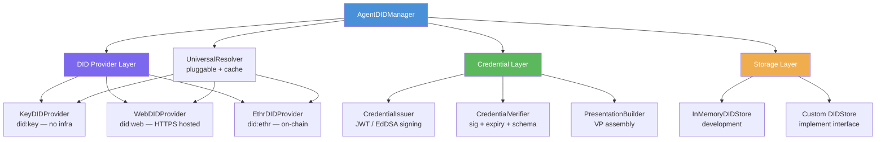

# @aumos/agent-did

[](https://github.com/aumos-ai/agent-did-framework)
[](https://www.npmjs.com/package/@aumos/agent-did)
[](LICENSE)

W3C Decentralized Identifiers and Verifiable Credentials for AI agent trust attestation.

Part of the [AumOS](https://github.com/aumos-ai) open-source governance protocol suite.

---

## Why Does This Exist?

### The Problem: AI Agents Have No Passports

When a human professional walks into a meeting, they can show a government-issued ID, a business card, and professional credentials. Every institution they interact with has a way to verify who they are and what they are authorized to do.

AI agents have none of that. When your research agent calls an API, sends a message, or requests access to a database, the receiving system has no reliable way to know: Is this the agent I authorized? Does it have permission to do this specific thing? Has it been tampered with since I last saw it?

Today, most systems solve this with API keys — shared secrets passed in headers. But API keys have no identity. They cannot prove *which agent* is calling, what that agent's capabilities are, or whether the caller was delegated authority by a human owner. Leak one key and any system can impersonate any agent. There is no revocation, no delegation chain, no audit trail that says "Human A delegated to Agent B who sub-delegated to Agent C."

### The Solution: Self-Sovereign Agent Identity

`@aumos/agent-did` gives every AI agent a cryptographically verifiable identity based on [W3C Decentralized Identifiers (DIDs)](https://www.w3.org/TR/did-core/) and [Verifiable Credentials (VCs)](https://www.w3.org/TR/vc-data-model/).

Think of it like a self-sovereign passport for your agent. The agent holds a cryptographic key pair. Its DID — a URI like `did:key:z6Mk...` — is derived from the public key. No central authority issues this. No registry needs to be online to verify it. Any system with the public key can verify that the agent signed a message, that a credential was issued to this exact agent, and that the credential has not been forged or modified.

### What Happens Without This

Without verifiable agent identity:
- Any system calling your APIs can claim to be your authorized agent
- Delegation chains are implicit — you cannot audit who authorized what
- Revoking access requires rotating API keys and redeploying every system that uses them
- Compliance auditors cannot prove which agent performed which action
- Multi-agent pipelines cannot verify that sub-agents were authorized by the original principal

---

## Install

```sh
npm install @aumos/agent-did
```

Node.js 18 or higher is required.

---

## Quick Start

### Prerequisites

- Node.js >= 18
- npm or pnpm
- `npm install @aumos/agent-did`

### Minimal Working Example

```typescript
import { AgentDIDManager } from "@aumos/agent-did";

// 1. Create the manager (in-memory store, did:key + did:web resolvers by default)
const manager = new AgentDIDManager();

// 2. Create a DID for your agent
const identity = await manager.createAgentDID({
  method: "did:key",
  agentAlias: "research-agent-v1",
});

console.log(identity.did);
// did:key:z6Mk...

// 3. Issue a Verifiable Credential
const vc = await manager.issueAgentCredential({
  issuerDID: identity.did,
  agentDID: identity.did,
  credentialType: "AgentCapability",
  claims: {
    credentialType: "AgentCapability",
    agentName: "Research Agent",
    agentVersion: "1.0.0",
    agentType: "assistant",
    registeredAt: new Date().toISOString(),
  },
});

// 4. Verify the credential at a relying party
const result = await manager.verifyCredential(vc);

console.log(result.valid);   // true
console.log(result.claims);  // { credentialType: "AgentCapability", agentName: "Research Agent", ... }
```

**What just happened?**

1. A fresh Ed25519 key pair was generated in memory.
2. A DID (`did:key:z6Mk...`) was derived from the public key — no network call needed.
3. A JWT Verifiable Credential was signed with the private key and issued to the agent's DID.
4. The verifier resolved the DID, retrieved the public key, and confirmed the JWT signature — without contacting any central server.

Any system that receives this JWT can run the same verification independently. The agent's identity is self-contained and cryptographically unforgeable.

---

## Architecture Overview



`AgentDIDManager` is the single entry point. It composes a DID provider (how DIDs are created and resolved), credential issuance/verification, and a pluggable storage backend. In production, swap `InMemoryDIDStore` for any persistent store by implementing the `DIDStore` interface.

This fits into the broader AumOS ecosystem as the identity primitive: trust-gate uses agent DIDs to authorize MCP calls; the edge runtime validates agent DIDs offline; audit logs record agent DIDs as the subject of every governance decision.

---

## DID Methods

| Method | When to use |
|--------|-------------|
| `did:key` | Development, testing, self-sovereign agents, no infrastructure needed |
| `did:web` | Production agents with a stable HTTPS domain to host the DID document |
| `did:ethr` | Agents anchored to an Ethereum address; resolution requires an RPC endpoint |

See [docs/did-methods.md](docs/did-methods.md) for detailed guidance.

---

## Credential Types

Three generic credential types are included:

- **AgentIdentity** — asserts that a DID belongs to an AI agent (name, version, type)
- **AgentCapability** — asserts that an agent is authorized to exercise a named capability
- **AgentDelegation** — asserts that an agent may act on behalf of an owner DID

All three use JWT proof format (EdDSA / Ed25519). See [docs/credential-schemas.md](docs/credential-schemas.md).

---

## Who Is This For?

**Developers** building multi-agent systems who need to authenticate agents to external APIs, databases, or other agents without sharing API keys.

**Enterprise teams** who need auditable delegation chains — proof that Agent C was authorized by Agent B which was authorized by Human A — for compliance and incident response.

Both groups benefit from the W3C standards base: DID and VC are open standards implemented across dozens of libraries and platforms, with no vendor lock-in.

---

## Examples

Working examples live in [`examples/`](examples/README.md):

- `examples/basic-agent-did.ts` — create a DID and issue an AgentIdentity VC
- `examples/verify-agent-credential.ts` — verify a JWT credential end-to-end
- `examples/delegation-chain.ts` — multi-hop delegation with AgentDelegation VCs

---

## API Reference

The primary entry point is `AgentDIDManager`. All exported types are documented with TSDoc in `src/`.

```typescript
import {
  AgentDIDManager,
  AgentDIDIdentity,
  CredentialIssuer,
  CredentialVerifier,
  PresentationBuilder,
  InMemoryDIDStore,
  InMemoryCredentialStore,
  KeyDIDProvider,
  WebDIDProvider,
  EthrDIDProvider,
  UniversalResolver,
} from "@aumos/agent-did";
```

---

## Related Projects

| Repo | How it relates |
|------|---------------|
| [mcp-server-trust-gate](https://github.com/aumos-ai/mcp-server-trust-gate) | Uses agent DIDs to authorize MCP tool calls |
| [aumos-edge-runtime](https://github.com/aumos-ai/aumos-edge-runtime) | Validates agent DIDs offline on constrained hardware |
| [trust-certification-toolkit](https://github.com/aumos-ai/trust-certification-toolkit) | Issues certification badges to governance implementations |
| [aumos-core](https://github.com/aumos-ai/aumos-core) | Core governance protocol that agent DIDs plug into |

---

## Fire Line

This package implements open, generic W3C DID and VC primitives. It does not contain AumOS-proprietary trust scoring, behavioral analysis, or adaptive budget allocation. See [FIRE_LINE.md](FIRE_LINE.md).

---

## Contributing

See [CONTRIBUTING.md](CONTRIBUTING.md).

---

## License

Business Source License 1.1. See [LICENSE](LICENSE).

Copyright (c) 2026 MuVeraAI Corporation
